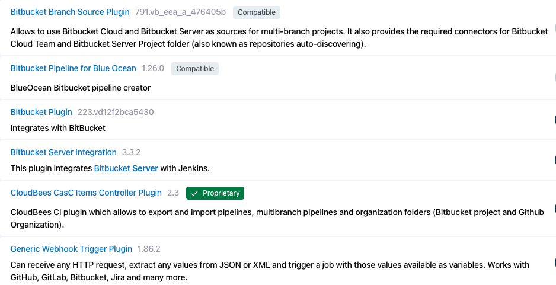
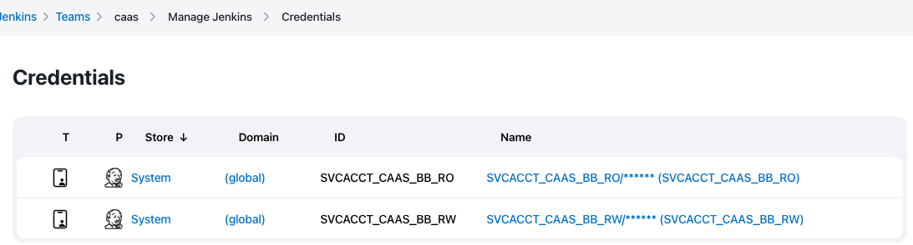
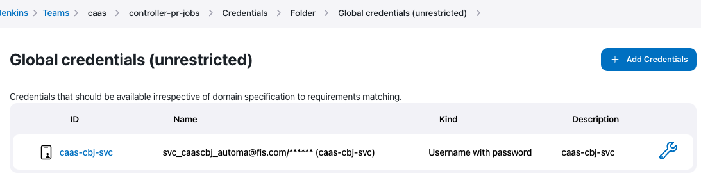

# Controller Creation Pipeline

## Setting CAAS Controller
1. Make sure CAAS controller has the following plugins installed:

2. Make sure CAAS controller has the following global credentials:

3. Create `controller-pr-jobs` folder
4. Set the following credentials in the `controller-pr-jobs` folder:

5. Set the following pipeline libraries in the `controller-pr-jobs` folder: 

|                  |                                                                                                                                                                                                                                                                                                                                                                                           |                                                                                                                                                                                                                                                                                                                                            |
|:-----------------|-------------------------------------------------------------------------------------------------------------------------------------------------------------------------------------------------------------------------------------------------------------------------------------------------------------------------------------------------------------------------------------------|--------------------------------------------------------------------------------------------------------------------------------------------------------------------------------------------------------------------------------------------------------------------------------------------------------------------------------------------|
| `Name`           | common-lib                                                                                                                                                                                                                                                                                                                                                                                | caas-shared-lib                                                                                                                                                                                                                                                                                                                            |
| `Default Version`| 3-stable                                                                                                                                                                                                                                                                                                                                                                                  | main                                                                                                                                                                                                                                                                                                                                       |
|              | [ ] Load implicitly  [x] Allow default version to be overridden  [ ] Include @Library changes in job recent changes   [ ] Cache fetched versions on controller for quick retrieval                                                                                                                                                                                            | [ ] Load implicitly  [x] Allow default version to be overridden  [ ] Include @Library changes in job recent changes   [ ] Cache fetched versions on controller for quick retrieval                                                                                                                                             |
|`Retrieval Method`| Modern SCM ➡️ Git <table>  <tbody>  <tr>  <td>Project Repository:</td>  <td><code>https://bitbucket.fis.dev/scm/cicdlibs/common-lib.git </code></td>  </tr>  <tr>  <td>Credentials:</td>  <td><code>SVCACCT_CAAS_BB_RO</code></td>  </tr>  <tr>  <td>Behaviors:</td>  <td><code>Discovery Branches</code></td>  </tr>  </tbody>  </table> | Modern SCM ➡️ Git <table>  <tbody>  <tr>  <td>Project Repository:</td>  <td><code>https://bitbucket.fis.dev/scm/caas/caas-shared-library.git </code></td>  </tr>  <tr>  <td>Credentials:</td>  <td><code>SVCACCT_CAAS_BB_RO</code></td>  </tr>  <tr>  <td>Behaviors:</td>  <td><code>Discovery Branches</code></td>  </tr>  </tbody>  </table>  |

---
**Credentials**

The usernames/passwords and tokens needed for the Jenkins Admin Jobs are in:
`Aws Account`: CaaS-Tools-DevZone #683901948415  
`Secret Name`: caas/Cloudbees/AdminJobsCredentials

---